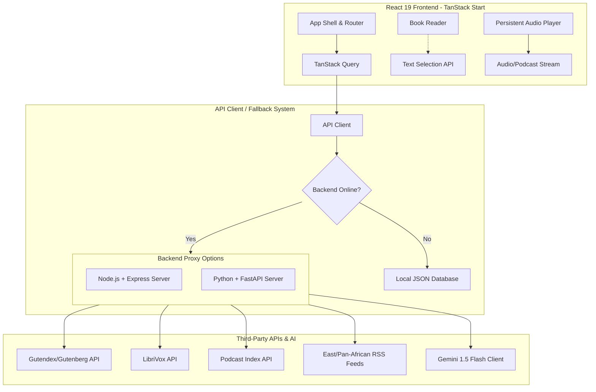

# 📖 Golden Reads (Readers' Haven)

[](https://react.dev/)
[](https://www.typescriptlang.org/)
[](https://tanstack.com/router/v1/docs/start/overview)
[](https://tailwindcss.com/)
[](https://ai.google.dev/)
[](https://fastapi.tipe.com/)
[](https://expressjs.com/)

Golden Reads is a premium, high-performance web application designed for digital bookworms, audiophiles, and news enthusiasts. It provides a cohesive platform to search and read public domain classics, stream audiobooks and podcasts, and browse regional East African and global magazines—all augmented by an intelligent, context-aware AI reading companion ("Lit Companion") powered by **Google Gemini 1.5 Flash**.

---

## 🏗️ Architecture Overview

The platform uses a decoupled frontend client built with **TanStack Start** (SSR-ready React) and provides two interchangeable, production-ready backend servers (Node.js/Express or Python/FastAPI) to handle external API integrations and LLM orchestrations.



---

## ✨ Core Features

### 1. 📖 E-Book Library & Reader
* **Catalog Exploration:** Live search and explore classic literature powered by the **Gutendex (Project Gutenberg)** API.
* **Themes & Typography:** Fully-featured e-reader layout with Cream, Sepia, and Night visual modes, along with real-time text scaling controls.
* **Local Selection Actions:** Highlight any term or phrase to activate context-specific AI definitions and vocabulary explanations.

### 2. 🎧 Audiobooks & Podcasts
* **LibriVox Catalog:** Search and play free public domain audiobooks with dedicated chapter navigation.
* **Podcast Index Integration:** Discover and stream public podcasts utilizing secure HMAC authentication signatures.
* **Persistent Media Player:** System-wide audio bar with speed modifiers (`1x`, `1.25x`, `1.5x`, `2x`), scrubbing timelines, custom volume sliders, and back/forward shortcuts.

### 3. 📰 Regional Magazines & Archive search
* **RSS Aggregate Reader:** Grouped feeds from East Africa (Kenya, Uganda, Tanzania, Rwanda, Ethiopia) and pan-African/international tech and business media (Wired, TechCrunch, HBR).
* **Internet Archive Integration:** Search historical digital publications and periodicals hosted on the Internet Archive text database.

### 4. 🧠 Gemini-Powered "Lit Companion"
* **Outline Chapter:** Generate dynamic, high-quality chapter summaries under 120 words.
* **Explain & Define:** Provide contextual, in-line dictionary definitions for archaic words or dense passages.
* **Study Flashcards:** Extract concepts from selected text and generate interactive, flippable flashcard decks.
* **Personalized Recommendations:** Provide smart book suggestions matched against preferred genres and reading history.

### 5. 🔌 Offline-First Resiliency
* Seamless automatic switch to local fallback databases (`books.json`, `magazines.json`, `podcasts.json`) to keep the interface functional even when backend services or external APIs are unreachable.

---

## 🛠️ Technology Stack

### Frontend Client
* **Framework:** React 19, TypeScript
* **Meta-Framework & Routing:** TanStack Start (SSR, Nitro/h3 build configurations), TanStack Router (file-based routing)
* **Data Fetching:** TanStack Query (React Query) for caching and asynchronous state synchronization
* **Styling:** Tailwind CSS v4, Framer Motion for smooth layout transitions
* **State Management:** Zustand (slices for cart, library shelf, theme settings, and wishlist)

### Backend Services (Interchangeable)
* **Option A: Node.js (Express)**
  * Core: Express, TSX, dotenv
  * AI SDK: `@google/genai` (v2.4.0)
* **Option B: Python (FastAPI)**
  * Core: FastAPI, Uvicorn, httpx, python-dotenv
  * RSS Parser: `feedparser`
  * AI SDK: `google-generativeai`

---

## 📂 Project Structure

```text
├── src/                          # Frontend Application
│   ├── assets/                   # Static images, vectors, and fonts
│   ├── components/               # React Components
│   │   ├── ai/                   # Lit Companion AI drawer and features
│   │   ├── audio/                # Persistent Audiobook/Podcast player
│   │   ├── book/                 # Book card grid and Gutenberg reader
│   │   ├── layout/               # AppShell, TopBar, and Navigation Layouts
│   │   └── ui/                   # Raw design elements (buttons, sliders, inputs)
│   ├── data/                     # Local offline JSON fallback databases
│   ├── hooks/                    # Reusable React hooks
│   ├── lib/                      # Base libraries, API clients, and SSR error handles
│   ├── routes/                   # TanStack Router page tree (index, book.$id, magazines, etc.)
│   ├── store/                    # Zustand global store slices
│   └── styles.css                # Global styles and Tailwind imports
│
├── readers-backend/              # Express Backend Server (Node.js)
│   ├── src/                      # Standalone dev interface
│   ├── server.ts                 # Main Express server (ports Gutendex, Gemini, Librivox)
│   └── readers-backend/          # Python Backend Service (FastAPI)
│       └── app/
│           ├── main.py           # FastAPI entrypoint
│           ├── routers/          # Endpoints divided by category (ai, books, audio, etc.)
│           └── services/         # Gemini, RSS parsing, and third-party wrappers
│
├── package.json                  # Root build and scripts
└── bunfig.toml / bun.lock        # Package manager lock files
```

---

## 🚀 Getting Started

### Prerequisites
* **Node.js** (v18.0+) or **Bun** installed.
* **Python** (v3.10+) if running the FastAPI backend.
* A **Google Gemini API Key** (Get one from [Google AI Studio](https://aistudio.google.com/)).

---

### Setup Steps

#### 1. Configure Environment Variables
Create a `.env` file in the project root:
```env
VITE_API_URL=http://localhost:8000
```

Create a `.env` file in the backend directory (`readers-backend/.env` or `readers-backend/readers-backend/.env`):
```env
GEMINI_API_KEY="your_actual_gemini_api_key"
APP_URL="http://localhost:3000"

# Optional (for full Podcast Index search support)
# PODCAST_INDEX_KEY="your_podcast_index_key"
# PODCAST_INDEX_SECRET="your_podcast_index_secret"
```

---

#### 2. Start Your Preferred Backend Companion

##### Option A: Node.js (Express) Backend
1. Navigate to the backend directory:
   ```bash
   cd readers-backend
   ```
2. Install dependencies:
   ```bash
   npm install
   ```
3. Run the development server (runs on port `3000` or `8000` depending on environment):
   ```bash
   npm run dev
   ```

##### Option B: Python (FastAPI) Backend
1. Navigate to the Python backend directory:
   ```bash
   cd readers-backend/readers-backend
   ```
2. Create and activate a virtual environment:
   ```bash
   python -m venv .venv
   # Windows
   .venv\Scripts\activate
   # macOS/Linux
   source .venv/bin/activate
   ```
3. Install dependencies:
   ```bash
   pip install -r requirements.txt
   ```
4. Run the FastAPI server:
   ```bash
   python -m app.main
   ```
   *The server will start at `http://localhost:8000` with interactive Swagger docs at `http://localhost:8000/docs`.*

---

#### 3. Run the Frontend Client
1. Open a new terminal in the project root directory.
2. Install frontend dependencies:
   ```bash
   bun install
   # or
   npm install
   ```
3. Start the TanStack Start development server:
   ```bash
   bun run dev
   # or
   npm run dev
   ```
4. Open your browser and navigate to the address displayed in the console (typically `http://localhost:3000`).

---

## 📦 Production Builds

To compile the application for production deployment:

### Frontend
```bash
bun run build
# or
npm run build
```
This builds the client assets and configures the server-side Nitro engine.

### Node.js Backend
```bash
cd readers-backend
npm run build
```

---

## 🤝 Open Source Integrations
Special thanks to the open APIs that make this reader possible:
* [Project Gutenberg / Gutendex](https://gutendex.com/)
* [LibriVox Free Audiobooks](https://librivox.org/)
* [Podcast Index API](https://podcastindex.org/)
* [Internet Archive](https://archive.org/)
